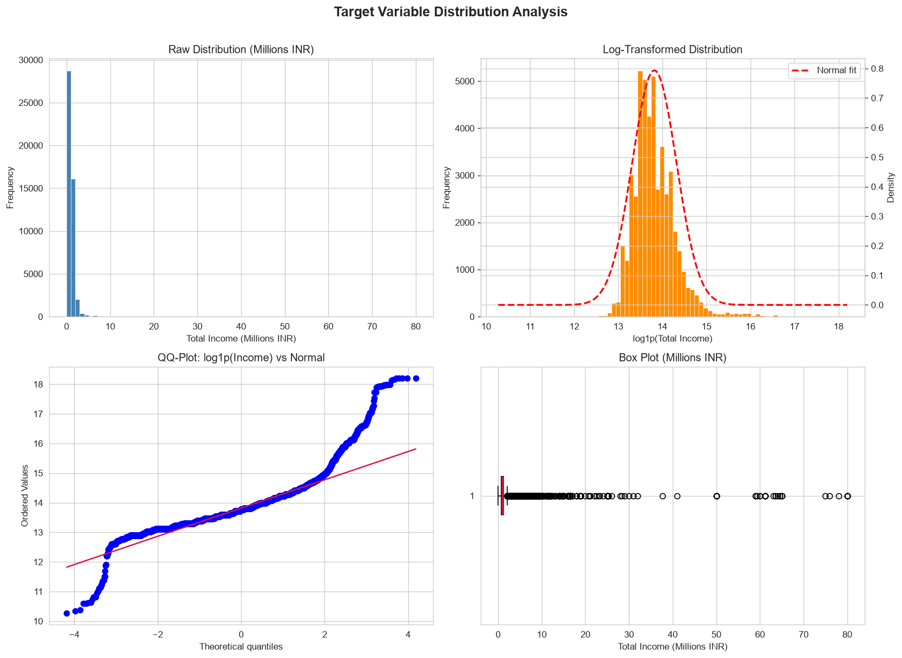
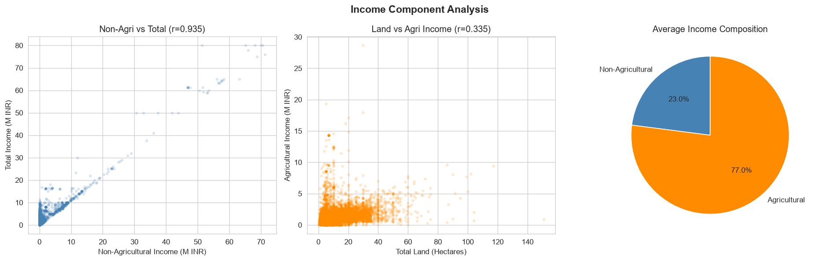
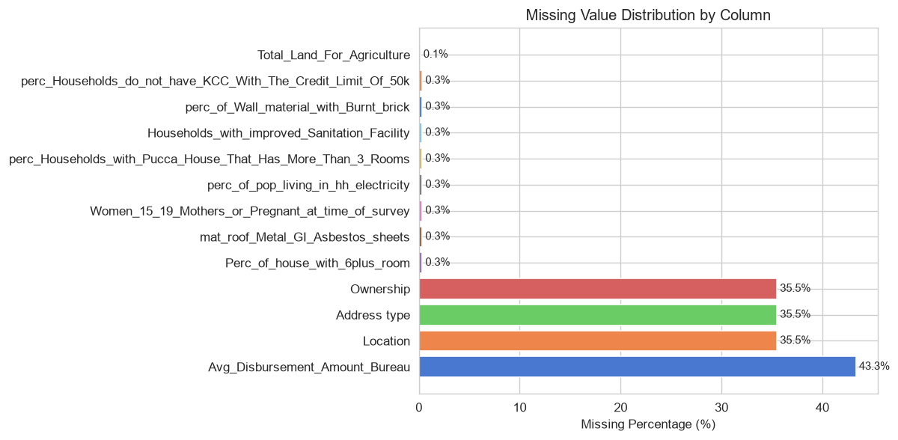
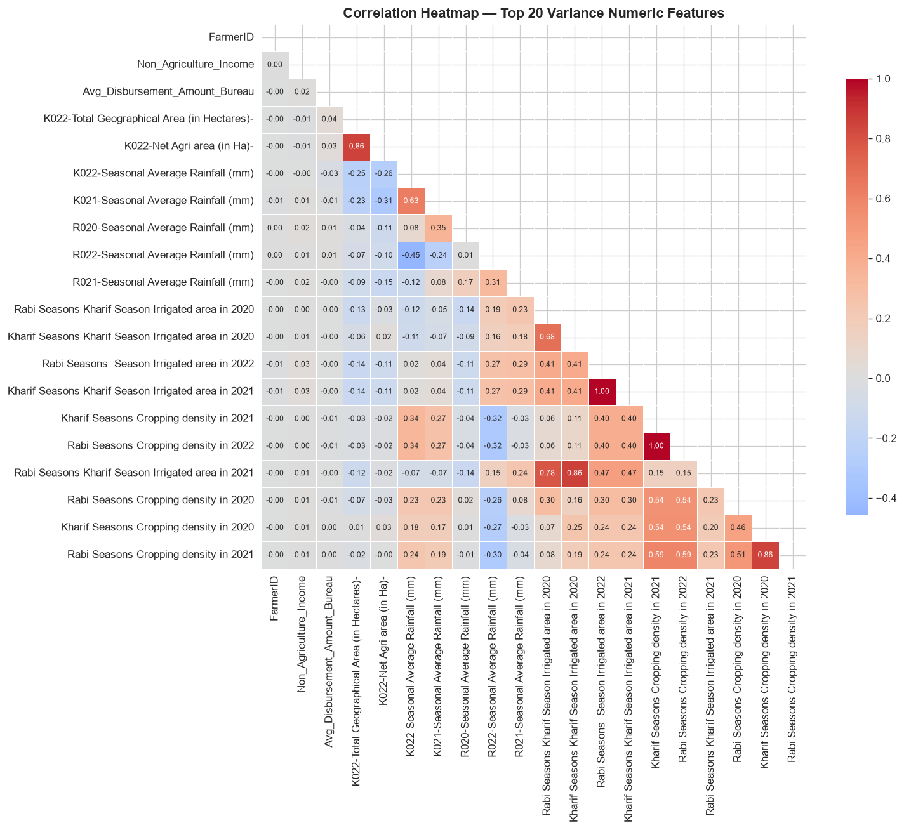
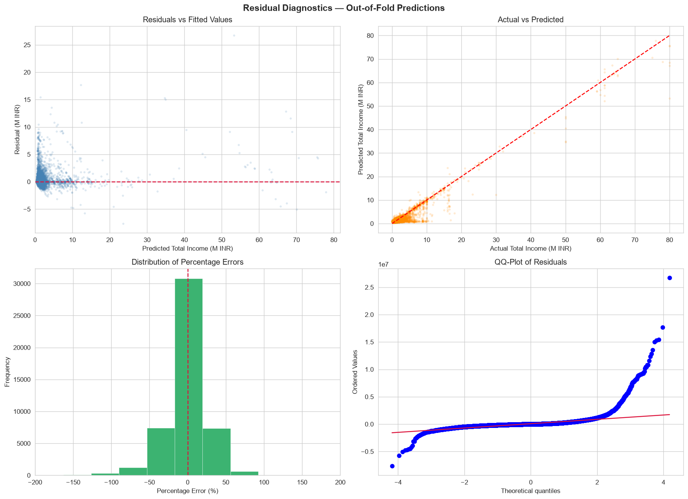
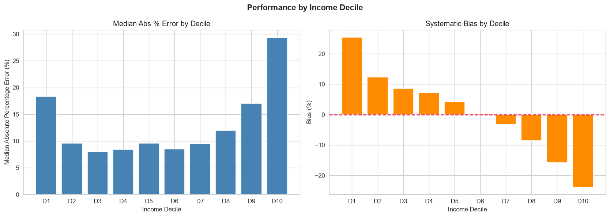
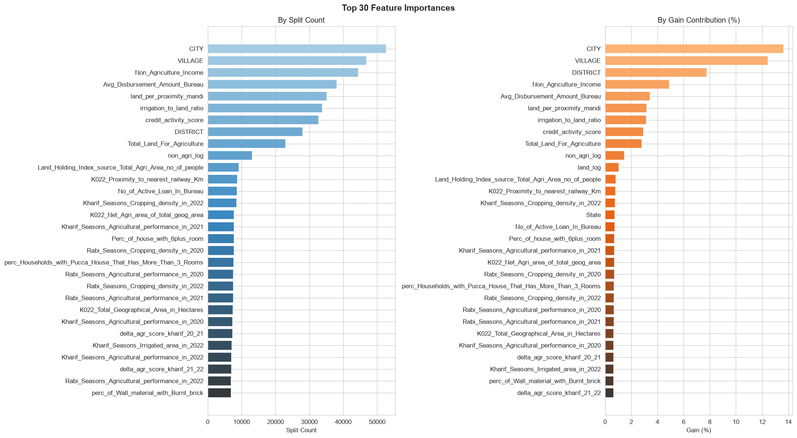

# End-to-End Farmer Income Prediction with LightGBM

[](https://www.python.org/)
[](https://lightgbm.readthedocs.io/)
[](LICENSE)
[](Model/artifacts/cv_metrics.json)
[](Model/artifacts/cv_metrics.json)

## Executive Summary

This repository delivers an end-to-end predictive modeling pipeline designed to estimate agricultural household income across rural India using high-dimensional tabular data. Combining geographic information, credit bureau disbursement records, historical seasonal crop metrics, remote sensing ground-water indices, and village socio-economic parameters, the system deploys a gradient-boosted decision tree architecture (LightGBM) optimized under a domain-specific income decomposition strategy.

Through rigorous 5-fold cross-validation, the final model achieves an out-of-fold coefficient of determination ($R^2$) of **0.9215**, a mean absolute error (MAE) of **235,858**, and a weighted absolute percentage error (WAPE) of **19.30%**, demonstrating high predictive stability across heterogeneous agro-ecological regions.

---

## Problem Statement and Domain Context

Accurate estimation of farmer income is critical for agricultural lending, credit underwriting, crop insurance claims, and government subsidy allocation. Traditional assessment mechanisms rely on manual land inspections and self-reported declarations, which are subject to high verification overhead and reporting bias.

The primary objective is to build a robust regression pipeline to predict `Target_Variable/Total Income` on unseen test farmers while mitigating extreme skewness, regional variance, and multi-source seasonal features.

### Core Mathematical Formulation: Income Decomposition

Exploratory analysis reveals that total farmer income is structurally composed of two distinct streams:

$$\text{Total Income} = \text{Agricultural Income} + \text{Non-Agricultural Income}$$

Where:
- $\text{Non-Agricultural Income}$ is already observed and documented in the survey data.
- $\text{Agricultural Income}$ contains volatility driven by seasonal precipitation, soil types, groundwater levels, and cropped acreage.

Rather than predicting total income directly (which exhibits an artificial additive noise floor and high heteroscedasticity), the modeling engine frames the task as learning the agricultural component via log-transformed residuals:

$$\hat{y}_{\text{agri}} = \exp\left( f_{\text{LightGBM}}(X) \right) - 1$$
$$\widehat{\text{Total Income}} = \hat{y}_{\text{agri}} + \text{Non-Agricultural Income}$$

This formulation guarantees that predicted total income strictly respects individual non-agricultural baselines and resolves target right-skewness.

---

## Dataset Overview

The dataset integrates multi-year socio-economic, satellite-derived, and meteorological features across Kharif and Rabi agricultural seasons:

- **Training Cohort**: 47,970 farmers
- **Holdout Test Set**: 9,986 farmers
- **Dimensionality**: 130 input features after feature engineering and cleaning
- **Feature Categories**:
  - **Demographics & Identification**: Region, State, District, City, Village, Marital Status, Ownership, Address Type.
  - **Credit Bureau Profiles**: Number of active loans, average disbursement amount.
  - **Agricultural Capacity**: Total agricultural land, net sown area, irrigated percentage.
  - **Multi-Year Seasonal Agronomic Metrics (2020-2022)**: Cropping density, agricultural performance scores, soil classifications, groundwater replenishment rates across Kharif (monsoon) and Rabi (winter) crop cycles.
  - **Infrastructure & Remote Sensing**: Night light indices, road density, proximity to nearest railway and mandi (market).
  - **Macro-Climate**: Seasonal precipitation and ambient temperature ranges (parsed into minimum, maximum, and diurnal spreads).

---

## Pipeline Architecture

The end-to-end pipeline is structured inside `Model/farmer_income_prediction.ipynb`:

```
Input Raw Data (lte_train.csv, lte_test.csv)
   |
   +---> [1] Exploratory Data Analysis & Quality Diagnostics
   |        - Target skewness check & log-transform analysis
   |        - Missingness profiling & multicollinearity inspection
   |
   +---> [2] Domain Feature Engineering
   |        - Parsing temperature min/max/range strings
   |        - Historical multi-year climate & agronomic deltas (2020-2022)
   |        - Agricultural density, land-to-mandi, & credit activity interaction ratios
   |        - Log transforms for skewed numerical covariates
   |
   +---> [3] Preprocessing & Sanitation
   |        - Column name sanitization (removing special JSON characters for LightGBM)
   |        - Missing value imputation via train-set medians
   |        - Label encoding of high-cardinality categorical attributes
   |
   +---> [4] Cross-Validation & Modeling
   |        - 5-Fold Stratified K-Fold (stratified on binned target distribution)
   |        - LightGBM regression (L1 MAE objective)
   |        - Early stopping with Out-Of-Fold (OOF) prediction aggregation
   |
   +---> [5] Evaluation & Diagnostics
   |        - Decile performance analysis, residual distribution, Q-Q diagnostics
   |        - Global feature importance analysis (Gain and Split)
   |
   +---> [6] Model Artifact Serialization
            - Persisting encoders, median imputers, metrics JSON, and submission CSV
```

---

## Exploratory Analysis & Key Insights

### 1. Target Variable Distribution
The target variable exhibits heavy positive skewness with a long right tail typical of economic survey data. Applying a $\log_{1p}$ transformation aligns the distribution closely with Gaussian normality.



### 2. Income Component Decomposition
Visualizing the relationship between agricultural income, non-agricultural income, and total revenue demonstrates the structural justification for residual modeling.



### 3. Missing Value Profiling
Missingness is primarily concentrated within survey-derived socio-economic metrics, addressed via robust train-split median imputation preventing data leakage.



### 4. Correlation Dynamics
Inter-feature correlations confirm strong co-dependencies between multi-year seasonal variables, justifying tree-based gradient boosting capable of handling correlated tabular features without severe collinearity penalties.



---

## Feature Engineering

Thirteen domain-specific features were generated to capture temporal trends and structural ratios:

1. **Temperature Parsing**: Deconstructed compound temperature intervals (`min & max`) into continuous `temp_min`, `temp_max`, and diurnal `temp_range` columns across all historical survey waves.
2. **Seasonal Agronomic Deltas**:
   - $\Delta \text{ Rainfall (Kharif 2021 to 2022)}$
   - $\Delta \text{ Groundwater Replenishment (2020 to 2022)}$
   - $\Delta \text{ Agricultural Score Trends (3-year rolling trajectory)}$
3. **Productive Capacity & Spatial Proximity**:
   - $\text{Irrigation Ratio} = \frac{\text{Irrigated Area}}{\text{Total Agricultural Land}}$
   - $\text{Land Density} = \frac{\text{Net Agricultural Area}}{\text{Total Geographical Area}}$
   - $\text{Land per Proximity to Mandi} = \frac{\text{Total Land}}{\text{Proximity to Mandi (Km)} + 1}$
4. **Credit Activity Index**: Composite index interacting loan counts with average disbursement amounts.

---

## Model Evaluation and Results

The model was evaluated using 5-Fold Stratified Cross-Validation. Folds were partitioned according to target income quantiles to guarantee identical outcome distributions across all splits.

### Cross-Validation Performance Comparison

| Metric | 5-Fold Baseline LightGBM | 5-Fold Tuned LightGBM | Out-Of-Fold (OOF) Final |
|---|---|---|---|
| **Mean Absolute Error (MAE)** | 236,829.63 | 235,858.26 | **235,858.26** |
| **Root Mean Squared Error (RMSE)** | - | - | **581,103.77** |
| **Root Mean Squared Log Error (RMSLE)** | 0.2940 | 0.2927 | **0.2927** |
| **Weighted Absolute % Error (WAPE)** | 19.38% | 19.30% | **19.30%** |
| **Coefficient of Determination ($R^2$)** | 0.9164 | 0.9166 | **0.9215** |

### Per-Fold Breakdown (Tuned Model)

| Fold | Best Iteration | MAE | RMSLE | WAPE | $R^2$ |
|---|---|---|---|---|---|
| Fold 1 | 4,991 | 230,147.32 | 0.2871 | 18.96% | 0.9356 |
| Fold 2 | 4,317 | 233,575.27 | 0.2867 | 19.21% | 0.9141 |
| Fold 3 | 3,800 | 238,449.72 | 0.2969 | 19.11% | 0.9434 |
| Fold 4 | 4,982 | 234,844.77 | 0.2959 | 19.42% | 0.9009 |
| Fold 5 | 2,234 | 242,274.24 | 0.2970 | 19.78% | 0.8888 |
| **Mean** | **4,065** | **235,858.26** | **0.2927** | **19.30%** | **0.9166** |

### Residual and Calibration Diagnostics

The residuals exhibit symmetrical bell-shaped distributions centered at zero, with consistent error bands across all predicted income deciles.





---

## Feature Importance and Interpretability

Global feature importance was evaluated via total Information Gain across split nodes. Spatial hierarchy and productive capacity emerge as dominant drivers:



### Top 10 Contributing Features

| Rank | Feature Name | Total Split Count | Information Gain | Gain Percentage |
|---|---|---|---|---|
| 1 | `CITY` | 52,677 | 944,819.77 | 13.64% |
| 2 | `VILLAGE` | 46,931 | 862,012.95 | 12.44% |
| 3 | `DISTRICT` | 28,061 | 538,796.30 | 7.78% |
| 4 | `Non_Agriculture_Income` | 44,468 | 339,868.81 | 4.91% |
| 5 | `Avg_Disbursement_Amount_Bureau` | 38,134 | 238,966.49 | 3.45% |
| 6 | `land_per_proximity_mandi` | 35,218 | 219,671.10 | 3.17% |
| 7 | `irrigation_to_land_ratio` | 33,895 | 218,961.72 | 3.16% |
| 8 | `credit_activity_score` | 32,768 | 203,537.67 | 2.94% |
| 9 | `Total_Land_For_Agriculture` | 22,992 | 195,253.23 | 2.82% |
| 10 | `non_agri_log` | 13,183 | 103,143.36 | 1.49% |

Geographic micro-clustering (`CITY`, `VILLAGE`, `DISTRICT`) accounts for over 33% of cumulative model gain, reflecting the acute localized nature of agricultural soil quality, water table access, and regional market pricing.

---

## Repository Structure

```
.
|-- Dataset/
|   |-- lte_dictionary.csv             # Feature definitions and descriptions
|   |-- lte_train.csv                  # Training observations (47,970 rows)
|   |-- lte_test.csv                   # Test holdout cohort (9,986 rows)
|
|-- Model/
|   |-- farmer_income_prediction.ipynb # Complete execution pipeline notebook
|   `-- artifacts/
|       |-- cv_metrics.json            # Baseline, tuned, and OOF evaluation metrics
|       |-- model_config.json          # Optimal hyperparameters and feature listings
|       |-- feature_importance.csv     # Ranked feature importance (split and gain)
|       |-- label_encoders.pkl         # Serialized categorical encoders
|       |-- train_medians.pkl          # Training distribution imputation values
|       |-- submission.csv             # Predictions generated for holdout test set
|       |-- correlation_heatmap.png    # Correlation matrix visualization
|       |-- feature_importance.png     # Visual summary of top 25 features
|       |-- income_decomposition.png   # Agricultural vs total income analysis
|       |-- missing_values.png         # Missingness distribution visual
|       |-- performance_by_decile.png  # Decile calibration and error spread
|       |-- residual_diagnostics.png   # Q-Q plot and residual density
|       |-- target_distribution.png    # Target distribution before/after log1p
|       `-- train_test_distribution.png# Train vs. test feature distribution
|
|-- .gitignore                         # Excludes large binaries (>100MB) from git tracking
|-- LICENSE                            # MIT License
|-- README.md                          # Project documentation
`-- requirements.txt                   # Environment dependencies
```

> **Note on Model Weights**: In accordance with GitHub repository limits and machine learning best practices, raw compiled model binaries (`final_lgbm_model.pkl` and `final_lgbm_model.txt`, ~105 MB each) are managed locally and excluded via `.gitignore`. The complete model can be reproduced deterministically by running the training pipeline notebook.

---

## Getting Started

### Prerequisites

Ensure you have Python 3.9 or higher installed. Clone the repository and install dependencies using `requirements.txt`:

```bash
git clone https://github.com/NumiKun/Farmer-Income-Prediction.git
cd Farmer-Income-Prediction
pip install -r requirements.txt
```

### Reproducing the Pipeline

1. Verify dataset placement:
   Ensure `lte_train.csv`, `lte_test.csv`, and `lte_dictionary.csv` reside in the `Dataset/` directory.

2. Execute the pipeline:
   Launch Jupyter and execute all cells in `Model/farmer_income_prediction.ipynb`:
   ```bash
   jupyter notebook Model/farmer_income_prediction.ipynb
   ```
   The notebook will automatically clean the data, generate interaction terms, run cross-validation, display diagnostics, and write all serialized outputs to `Model/artifacts/`.

---

## Technical Specifications & Hyperparameters

- **Framework**: LightGBM (`lightgbm.LGBMRegressor`)
- **Objective Function**: Regression L1 (`regression_l1` / MAE minimization)
- **Validation Strategy**: 5-Fold Stratified Cross-Validation on Target Deciles
- **Number of Leaves**: 191
- **Learning Rate**: 0.03
- **Feature Fraction**: 0.70 (subsampling features per tree)
- **Bagging Fraction & Frequency**: 0.80 every 5 iterations
- **Regularization**: $\lambda_{L1} = 0.15$, $\lambda_{L2} = 0.05$
- **Minimum Child Samples**: 25
- **Optimal Estimators**: 4,268 (selected via early stopping)
- **Random Seed**: 42

---

## License

This project is licensed under the MIT License - see the [LICENSE](LICENSE) file for details.

---

## Author

Developed by [NumiKun](https://github.com/NumiKun).
